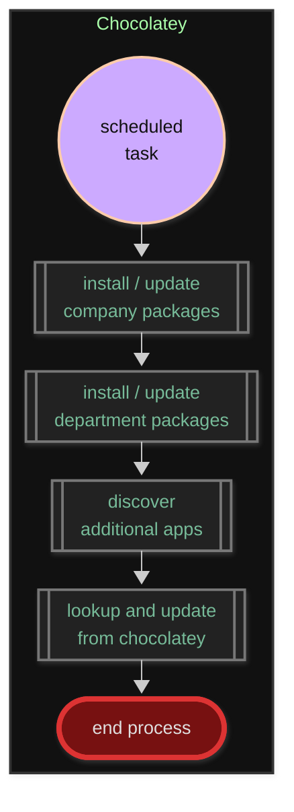

# PUBLIC facing data - Chocolatey  

> Machine-level, command-line package manager and installer for software on Microsoft Windows  

This repo houses basic application lists for deployment and management with Chocolatey.  

---

